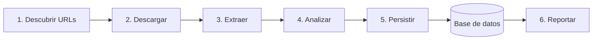
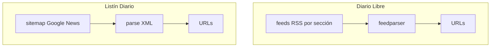
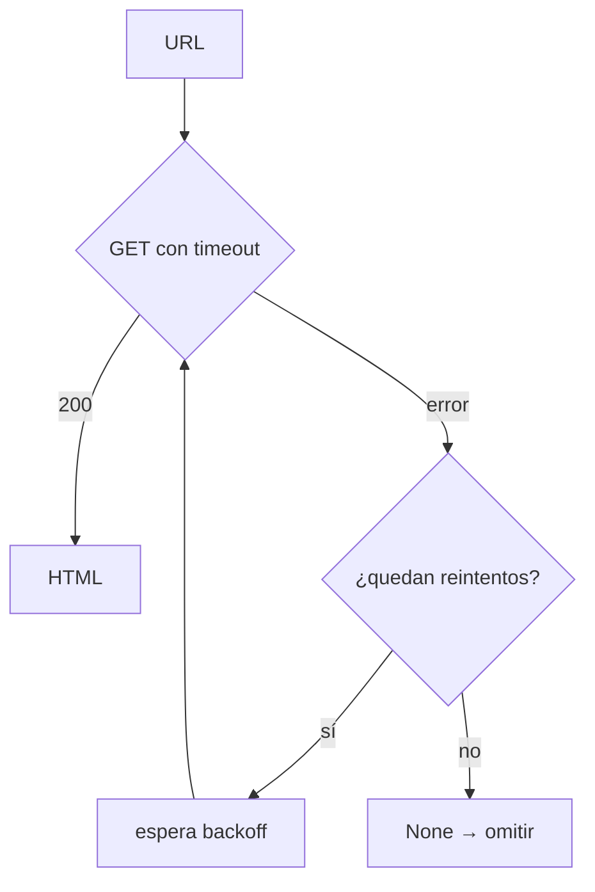
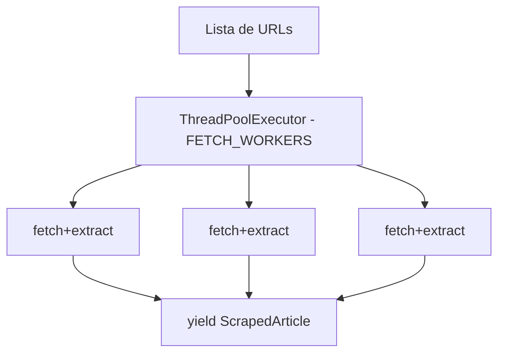
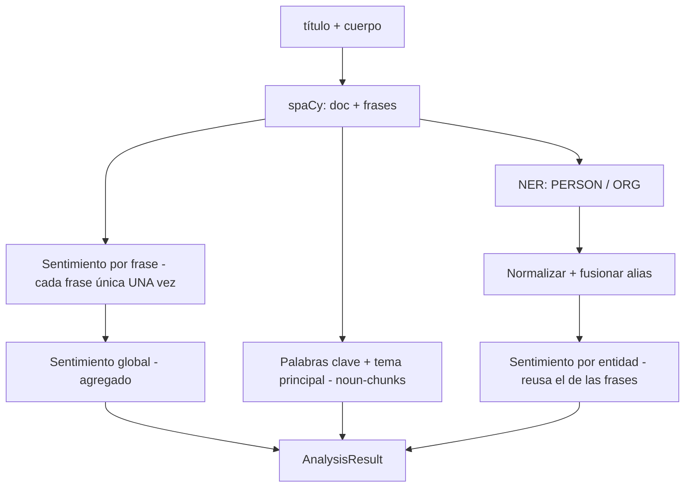
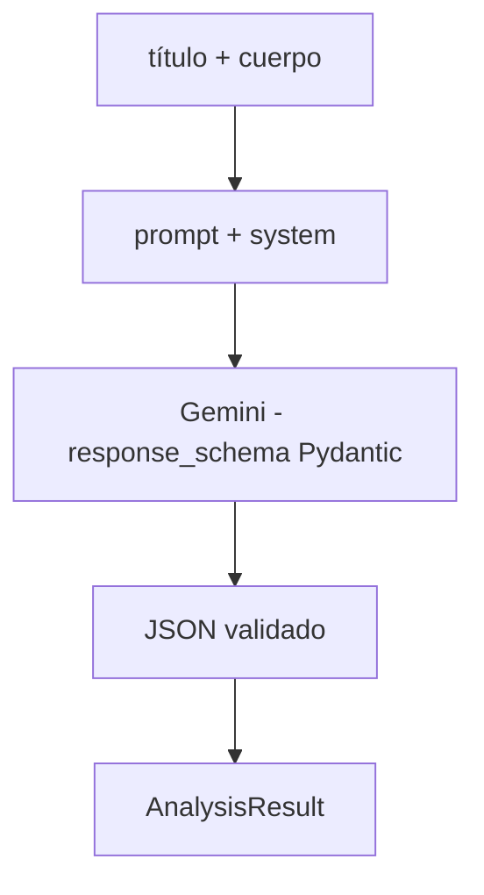
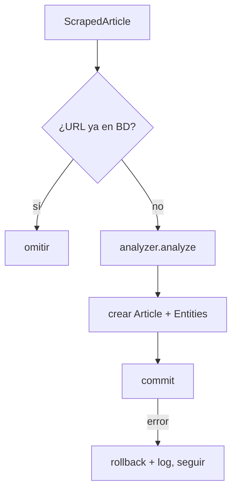
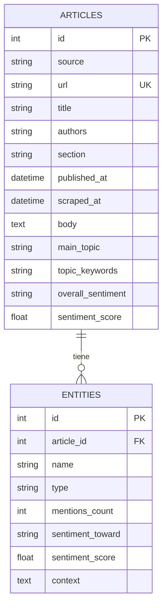
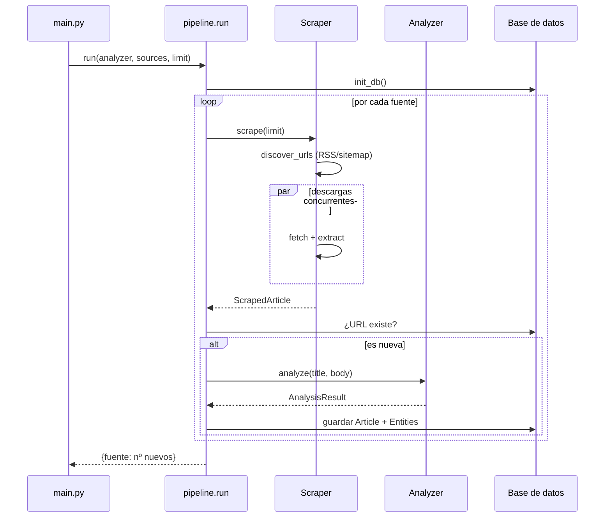

# Odin — Documentación de procesos

Este documento describe **cada proceso** que ejecuta Odin, de principio a fin:
qué hace, cómo lo hace, qué entra y qué sale, y dónde vive en el código.

> Para instalación y uso rápido, ver el [README](../README.md). Este documento es
> la referencia técnica de la **arquitectura y los procesos internos**.

---

## 1. Visión general

Odin rastrea periódicos dominicanos, extrae cada artículo, lo analiza (tema,
sentimiento, figuras/empresas y opinión hacia ellas) y lo guarda en una base de
datos. Todo el flujo lo orquesta un **pipeline** de 5 procesos encadenados:



| # | Proceso | Módulo | Entrada | Salida |
|---|---------|--------|---------|--------|
| 1 | Descubrir URLs | `scrapers/*` | Feed RSS / sitemap | Lista de URLs |
| 2 | Descargar | `scrapers/base.py` | URL | HTML |
| 3 | Extraer | `scrapers/base.py` | HTML | `ScrapedArticle` |
| 4 | Analizar | `analysis/*` | título + cuerpo | `AnalysisResult` |
| 5 | Persistir | `pipeline.py` | artículo + análisis | filas en BD |
| 6 | Reportar | `report.py` | BD | resumen en consola |

**Punto de entrada:** [`main.py`](../main.py) (CLI) → [`pipeline.run()`](../pipeline.py).

---

## 2. Proceso 1 — Descubrimiento de URLs

**Objetivo:** obtener la lista de artículos recientes de cada periódico.

Cada periódico expone sus artículos de forma distinta, así que cada scraper
implementa su propia estrategia de descubrimiento heredando de `BaseScraper`.



### Diario Libre — vía RSS
- Fuente: 9 feeds RSS (`portada`, `política`, `economía`, `mundo`, `deportes`…).
  Ver [`scrapers/diario_libre.py`](../scrapers/diario_libre.py).
- `BaseScraper.discover_urls()` recorre cada feed con `feedparser`, junta los
  enlaces y deduplica. Ver [`scrapers/base.py`](../scrapers/base.py).

### Listín Diario — vía sitemap de Google News
- Listín **no tiene RSS**; usa el sitemap de Google News
  (`sitemap-google-news.xml`), que lista los artículos más recientes.
- `ListinDiarioScraper.discover_urls()` descarga y parsea el XML con
  `ElementTree`, extrayendo cada `<loc>`. Ver
  [`scrapers/listin.py`](../scrapers/listin.py).

**Límite:** `discover_urls(limit=N)` corta en N URLs por fuente (parámetro
`--limit` del CLI / `MAX_ARTICLES_PER_SOURCE`).

---

## 3. Proceso 2 — Descarga (fetch)

**Objetivo:** descargar el HTML de cada URL de forma robusta y respetuosa.

`BaseScraper.fetch()` ([`scrapers/base.py`](../scrapers/base.py)):

- **Reintentos con backoff exponencial** ante errores de red
  (`FETCH_RETRIES`, espera `REQUEST_DELAY · 2^intento`).
- **User-Agent identificable** (`USER_AGENT`).
- Devuelve `None` si tras los reintentos no logra descargar (el artículo se
  omite, sin tumbar la corrida).



---

## 4. Proceso 3 — Extracción

**Objetivo:** convertir HTML crudo en campos estructurados.

`BaseScraper.extract()` usa **`trafilatura`**, que extrae contenido de artículos
de casi cualquier periódico sin selectores CSS frágiles. Devuelve un
`ScrapedArticle` con:

| Campo | Origen |
|-------|--------|
| `title` | metadato del artículo |
| `body` | texto principal (sin comentarios/menús) |
| `authors` | metadato `author` |
| `section` | primera categoría |
| `published_at` | fecha, parseada con `_parse_date()` (ISO 8601 → fallbacks) |
| `url`, `source` | del scraper |

Si falta título o cuerpo, se descarta el artículo (devuelve `None`).

---

## 5. Procesos 2+3 juntos — Concurrencia

Descarga y extracción se ejecutan **en paralelo** por fuente para solapar la
espera de red. `BaseScraper.scrape()` usa un `ThreadPoolExecutor` con
`FETCH_WORKERS` hilos (throttle de cortesía) y va entregando (`yield`) cada
`ScrapedArticle` a medida que se completa.



---

## 6. Proceso 4 — Análisis

**Objetivo:** extraer tema, sentimiento global, figuras/empresas y opinión hacia
cada una.

El análisis está detrás de una **interfaz intercambiable** `Analyzer`
([`analysis/base.py`](../analysis/base.py)): `analyze(title, body) -> AnalysisResult`.
Hay dos implementaciones; el resto del sistema no sabe cuál se usa.

### 4a. Analizador local (por defecto, gratis)

[`analysis/local_analyzer.py`](../analysis/local_analyzer.py) — `LocalAnalyzer`.

Combina **spaCy** (`es_core_news_lg`, para segmentar frases y NER) con
**pysentimiento** (sentimiento en español). Los modelos se cargan de forma
perezosa la primera vez.



Puntos clave del diseño:
- **Sentimiento calculado una sola vez por frase única** y reutilizado tanto
  para el global como para cada entidad (evita el recálculo redundante).
- **Tema principal** prefiere una frase nominal ("agua potable") sobre una sola
  palabra, usando `noun_chunks`.
- **Entidades normalizadas y fusionadas por alias**: "Policía" se funde en
  "Policía Nacional" (comparación sin acentos/mayúsculas, por límites de palabra).
- **`sentiment_toward` es una aproximación**: se agrega el sentimiento de las
  frases donde aparece la entidad. Es el campo más difícil solo con código
  (~60-70% de acierto); ver 4b para máxima precisión.

### 4b. Analizador Gemini (opcional, de pago)

[`analysis/gemini_analyzer.py`](../analysis/gemini_analyzer.py) — `GeminiAnalyzer`.

Usa la **API de Google Gemini** (SDK `google-genai`) con **salida estructurada**
(esquema Pydantic): una sola llamada por artículo devuelve tema, palabras clave,
sentimiento global y las entidades con su opinión ya clasificada. Mucho más
preciso en la opinión hacia figuras/empresas (entiende ironía y contexto).



- Modelo por defecto: `gemini-3.5-flash` (equilibrio calidad/coste);
  `gemini-3.5-pro` para máxima precisión.
- Requiere `pip install google-genai` y `GEMINI_API_KEY`.
- **No está activo por defecto**; se enchufa pasándolo a `run()`:
  ```python
  from analysis.gemini_analyzer import GeminiAnalyzer
  run(analyzer=GeminiAnalyzer())
  ```

### Comparación

| Campo | Local (gratis) | Gemini (de pago) |
|-------|----------------|------------------|
| Tema / palabras clave | Buena | Muy buena |
| Sentimiento global | ~75-85% | Muy buena |
| Figuras y empresas (NER) | ~80% | Muy buena |
| **Opinión hacia una figura** | **~60-70%** | **Muy buena** |

---

## 7. Proceso 5 — Persistencia

**Objetivo:** guardar cada artículo y sus entidades, sin duplicar.

[`pipeline.py`](../pipeline.py) orquesta scrape → analizar → guardar:



- **Deduplicación por URL**: no se re-analiza un artículo ya guardado.
- **Aislamiento de errores**: si un artículo falla, se hace `rollback` y se
  continúa con el siguiente (la corrida no se cae).
- **Commit por artículo**: prioriza resiliencia sobre velocidad de escritura.

### Base de datos — portabilidad

[`db/session.py`](../db/session.py) crea el engine de SQLAlchemy de forma
**perezosa** a partir de `DATABASE_URL`. Cambiar de motor es cambiar **una
línea** en `.env`, sin tocar código:

- **SQLite** (prueba rápida): `sqlite:///odin.db`
- **PostgreSQL** (desarrollo): `postgresql+psycopg2://…`
- **SQL Server** (cliente): `mssql+pyodbc://…`

Si la conexión falla, `init_db()` da un mensaje claro (y sugiere SQLite para
probar).

---

## 8. Modelo de datos

[`db/models.py`](../db/models.py) — dos tablas relacionadas 1‑a‑N.



- `overall_sentiment` / `sentiment_toward`: `POS` | `NEG` | `NEU`.
- `type`: `PERSON` | `ORG`.
- `entities.context`: frase de ejemplo que justifica el sentimiento.

---

## 9. Proceso 6 — Reportes

[`report.py`](../report.py) consulta la BD sin escribir SQL a mano:

- `python report.py` → resumen: nº de artículos por fuente, distribución de
  sentimiento, figuras/empresas más mencionadas.
- `python report.py --entity "Abinader"` → todas las menciones de una
  figura/empresa con su opinión y frase de contexto.

---

## 10. Configuración

Todo se controla por variables de entorno / `.env`
([`config.py`](../config.py), plantilla en [`.env.example`](../.env.example)):

| Variable | Por defecto | Efecto |
|----------|-------------|--------|
| `DATABASE_URL` | PostgreSQL local | Conexión a la BD (proceso 5) |
| `MAX_ARTICLES_PER_SOURCE` | 25 | Tope de artículos por fuente (proceso 1) |
| `REQUEST_DELAY` | 1.5 | Segundos base del backoff (proceso 2) |
| `FETCH_WORKERS` | 4 | Descargas concurrentes por fuente (procesos 2+3) |
| `FETCH_RETRIES` | 3 | Reintentos ante error de red (proceso 2) |
| `USER_AGENT` | OdinNewsBot/1.0 | Identificación en las peticiones (proceso 2) |

---

## 11. Cómo extender

### Agregar un periódico nuevo
1. Crear `scrapers/<periodico>.py` heredando de `BaseScraper`.
2. Definir `source`, `name` y `feeds` (si tiene RSS). Si no, sobreescribir
   `discover_urls()` (como hace Listín con su sitemap).
3. Registrarlo en `SCRAPERS` en [`scrapers/__init__.py`](../scrapers/__init__.py).

El resto (descarga, extracción, análisis, persistencia) funciona sin cambios.

### Cambiar el motor de análisis
Cualquier clase con `analyze(title, body) -> AnalysisResult` sirve. Se pasa a
`run(analyzer=…)`. Así conviven el `LocalAnalyzer` (gratis) y el
`GeminiAnalyzer` (Gemini), y se podría añadir otro proveedor sin tocar el resto.

---

## 12. Recorrido completo (ejemplo)


