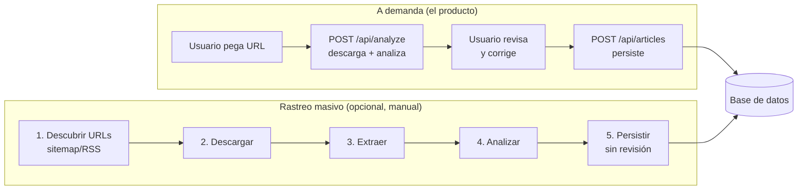
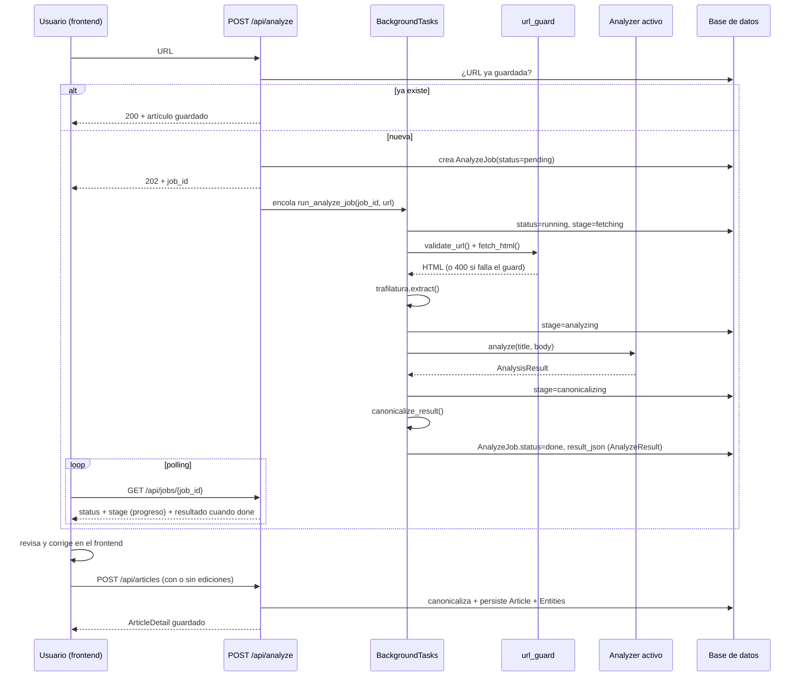
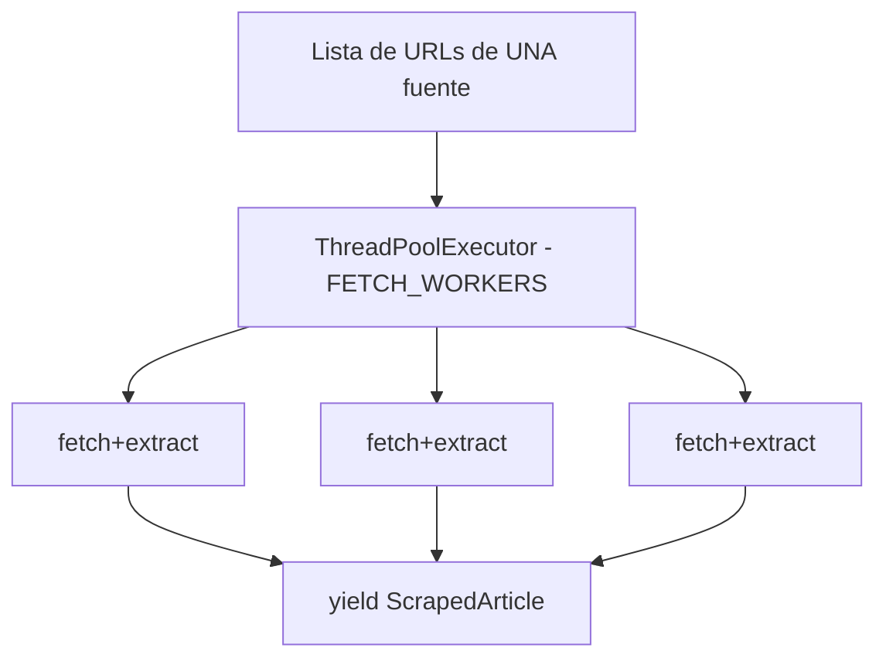
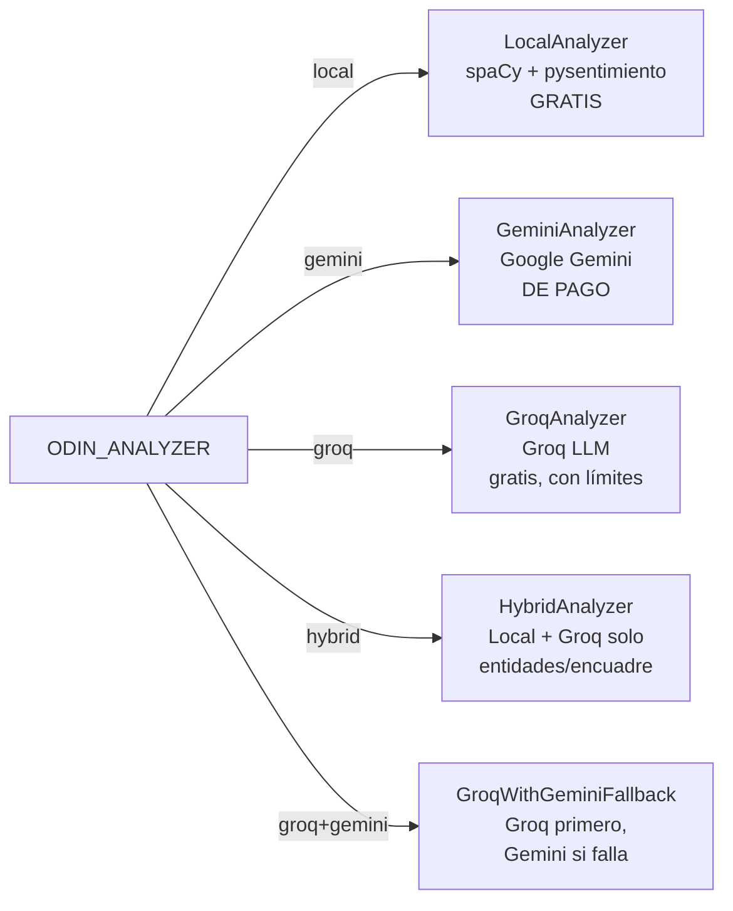
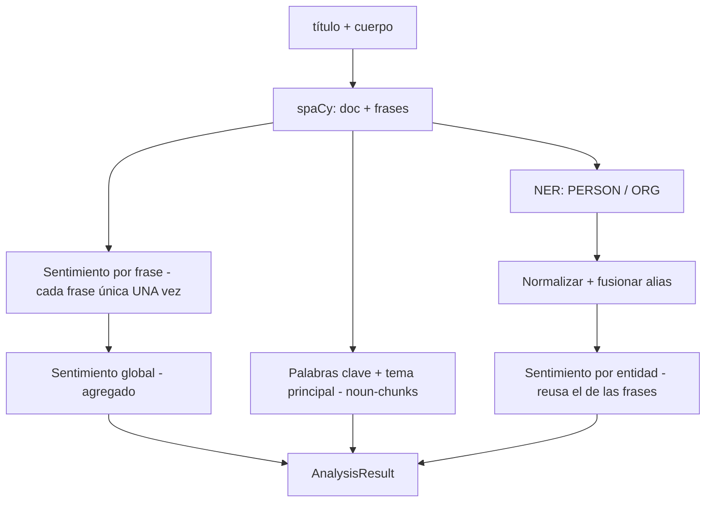
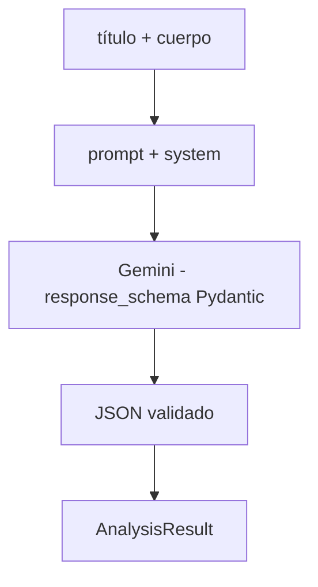
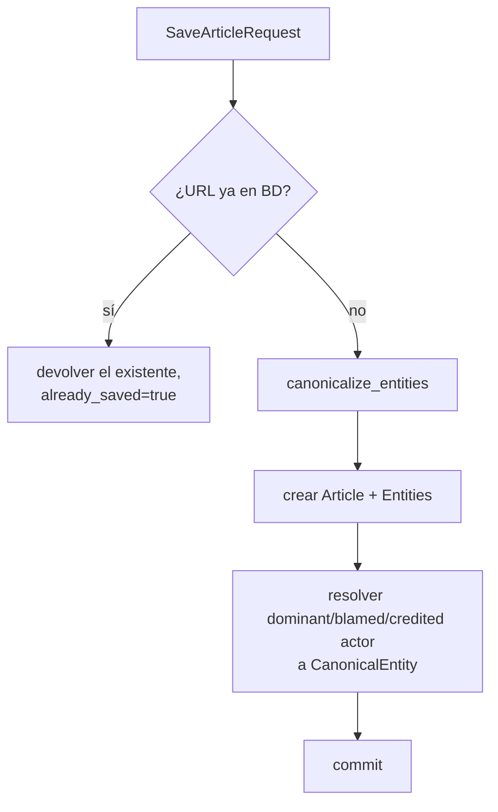
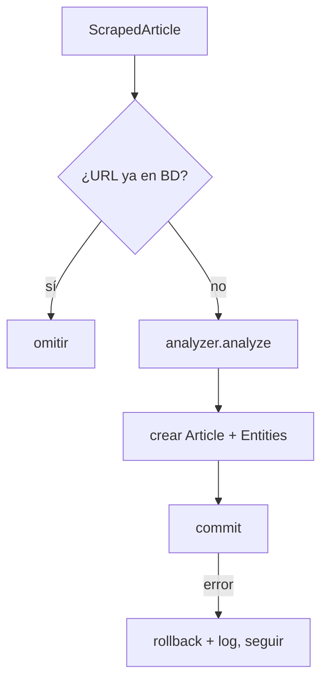
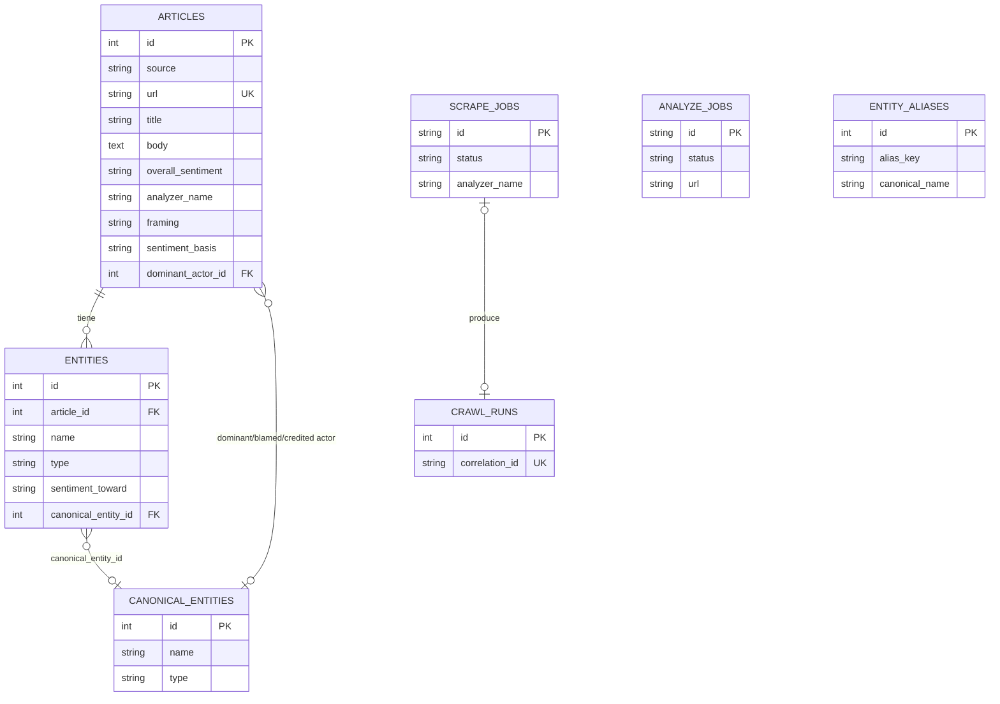
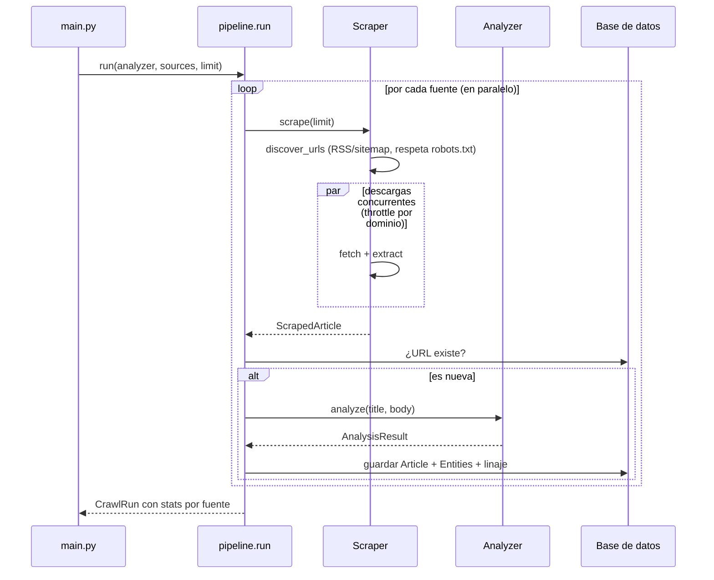

# Odin — Documentación de procesos

Este documento describe **cada proceso** que ejecuta Odin, de principio a fin:
qué hace, cómo lo hace, qué entra y qué sale, y dónde vive en el código.

> Para instalación y uso rápido, ver el [README](../README.md). Para la vista
> de componentes/estructura (qué archivo hace qué), ver
> [ARQUITECTURA.md](ARQUITECTURA.md). Este documento es la referencia técnica
> de los **procesos internos**: cómo fluyen los datos paso a paso.

---

## 1. Visión general

Odin tiene **dos flujos**, y el que importa hoy no es el que este documento
describía hasta ahora:

- **A demanda (el producto, §0.1 de task.md)**: el usuario pega la URL de un
  artículo en el frontend, Odin lo descarga y analiza, el usuario revisa y
  corrige, y decide si se guarda. Es el único flujo que corre en producción
  sin que alguien lo dispare a propósito.
- **Rastreo masivo (opcional y manual, conservado pero no el eje)**: `main.py`
  (CLI) o `POST /api/scrape-jobs` (desde la pestaña "Scraper" del frontend)
  disparan una corrida sobre las 9 fuentes configuradas, sin revisión humana
  por artículo. No hay cron ni scheduler — nunca corre solo.

Ambos comparten los mismos 4 procesos internos (descubrir → descargar+extraer
→ analizar → persistir); lo que cambia es quién dispara el proceso y si hay
revisión humana en el medio.

| # | Proceso | Módulo | Entrada | Salida |
|---|---------|--------|---------|--------|
| 1 | Descubrir URLs *(solo rastreo masivo)* | `scrapers/*` | Feed RSS / sitemap | Lista de URLs |
| 2 | Descargar + validar destino | `url_guard.py` (a demanda) / `scrapers/base.py` (masivo) | URL | HTML |
| 3 | Extraer | `scrapers/base.py` (`trafilatura`) | HTML | campos estructurados |
| 4 | Analizar | `analysis/*` | título + cuerpo | `AnalysisResult` |
| 5 | Persistir | `services/article_service.py` / `pipeline.py` | artículo + análisis | filas en BD |
| 6 | Reportar | `report.py`, pestaña Reportes | BD | resumen |

**Puntos de entrada:**
- A demanda: `POST /api/analyze` → `services/analyze_service.py` →
  `POST /api/articles` → `services/article_service.py::save_article`.
- Masivo: [`main.py`](../main.py) (CLI) → [`pipeline.run()`](../pipeline.py), o
  `POST /api/scrape-jobs` → [`scrape_jobs.py`](../scrape_jobs.py) →
  `pipeline.run()` en background.

---

## 2. Flujo a demanda

El producto, según la decisión de alcance de `task.md` §0.1.

**Objetivo:** analizar un artículo puntual que el usuario elige, con revisión
humana antes de guardar, en dos pasos HTTP para no bloquear el request hasta
un minuto.

Puntos clave:
- **Nunca bloquea el request principal más de lo necesario para encolar**: la
  descarga (hasta 60s de red con reintentos) y el análisis corren en
  `BackgroundTasks`, no en el handler de `POST /api/analyze` (§3.1 de
  task.md, resuelto).
- **`url_guard.fetch_html`** es la única salida de red hacia una URL que
  escribe el usuario: allowlist de dominios + bloqueo de IP privada
  (revalidado en cada redirección) + límite de tamaño — ver
  [ARQUITECTURA.md §5](ARQUITECTURA.md#5-seguridad).
- **No hay descubrimiento**: no se consulta ningún sitemap ni feed. La única
  URL que se toca es la que pegó el usuario.
- **Guardar es un paso aparte y explícito** (`POST /api/articles`): la vista
  previa de `/api/analyze` nunca escribe en la BD por sí sola. Por eso son dos
  schemas distintos: `AnalyzeResult`/`AnalyzePreviewEntity` para la vista previa
  (`id` `null` mientras no se guarde) y `ArticleDetail`/`EntityMention` para el
  artículo ya persistido (`id` y `body` siempre reales).
- **El polling reporta progreso, no solo "corriendo"**: `AnalyzeJob.stage`
  (`fetching` → `analyzing` → `canonicalizing`, ver `ANALYZE_STAGES` en
  `services/analyze_service.py`) viaja en cada respuesta de
  `GET /api/jobs/{id}` mientras `status=running`.

---

## 3. Proceso 1 — Descubrimiento de URLs (solo rastreo masivo)

**Objetivo:** obtener la lista de artículos recientes de cada periódico. Este
proceso **no corre en el flujo a demanda** — solo cuando se dispara una
corrida masiva.

Cada periódico expone sus artículos de forma distinta, así que cada scraper
implementa su propia estrategia heredando de `BaseScraper`
([`scrapers/base.py`](../scrapers/base.py)). De las 9 fuentes configuradas
(`scrapers/__init__.py::SCRAPERS`):

| Fuente | Descubrimiento | Módulo |
|---|---|---|
| Diario Libre | RSS (varias secciones) | [`scrapers/diario_libre.py`](../scrapers/diario_libre.py) |
| Listín Diario | Sitemap de Google News | [`scrapers/listin.py`](../scrapers/listin.py) |
| El Nacional, Hoy, El Caribe, Al Momento, El Día, N Digital | Sitemap y/o RSS | [`scrapers/do_scrapers.py`](../scrapers/do_scrapers.py) |
| Acento | Regex sobre el HTML de portada (sin sitemap/RSS fiable) | [`scrapers/do_scrapers.py`](../scrapers/do_scrapers.py) — excepción documentada, ver [ADR-001](adr/0001-trafilatura-y-sitemaps-sobre-selectores.md) |

`BaseScraper.discover_urls()` recorre feeds/sitemaps con `feedparser`/XML,
junta los enlaces y deduplica. `robots.txt` se respeta por defecto
(`_RobotsCache`, `ODIN_RESPECT_ROBOTS_TXT=true`): las rutas excluidas no se
piden, y si declara `Crawl-delay` mayor que `REQUEST_DELAY`, se usa ese valor.

**Límite:** `discover_urls(limit=N)` corta en N URLs por fuente (parámetro
`--limit` del CLI / `MAX_ARTICLES_PER_SOURCE` / `per_source_cap` de un
`scrape_job`).

---

## 4. Proceso 2 — Descarga (fetch)

**Objetivo:** descargar el HTML de cada URL de forma robusta, respetuosa y
segura.

Dos caminos distintos según el flujo, porque las garantías que necesitan son
distintas:

### A demanda: `url_guard.fetch_html()`

La URL la escribe un usuario autenticado, así que antes de descargar nada se
valida:
1. Allowlist de dominios (`ODIN_ALLOWED_DOMAINS`).
2. Resolución DNS + bloqueo si alguna IP es privada/loopback/link-local/CGNAT
   — revalidado en **cada** redirección (`allow_redirects=False`, seguidas a
   mano).
3. Límite de tamaño de respuesta (`ODIN_MAX_DOWNLOAD_BYTES`), `Content-Type`,
   puertos (80/443), esquema, sin credenciales embebidas en la URL.

### Rastreo masivo: `BaseScraper.fetch()`

Las URLs salen de sitemaps/feeds de fuentes ya configuradas en el código, no
de un usuario — no pasa por `url_guard`. En cambio:
- **Reintentos con backoff exponencial** ante errores de red (`FETCH_RETRIES`,
  espera `REQUEST_DELAY · 2^intento`).
- **Throttle real por dominio** (`_DomainThrottle`): intervalo mínimo entre
  dos peticiones exitosas al mismo host, sin importar cuántos
  `FETCH_WORKERS` concurrentes haya.
- **User-Agent identificable** (`USER_AGENT`).
- Devuelve `None` si tras los reintentos no logra descargar (el artículo se
  omite; no tumba la corrida, pero tampoco queda registrado en ninguna
  tabla — gap de observabilidad conocido, ver `task.md` §2.3).

---

## 5. Proceso 3 — Extracción

**Objetivo:** convertir HTML crudo en campos estructurados.

`BaseScraper.extract()` (usado por ambos flujos) usa **`trafilatura`**, que
extrae contenido de artículos de casi cualquier periódico sin selectores CSS
frágiles (ver [ADR-001](adr/0001-trafilatura-y-sitemaps-sobre-selectores.md)):

| Campo | Origen |
|-------|--------|
| `title` | metadato del artículo |
| `body` | texto principal (sin comentarios/menús) |
| `authors` | metadato `author` |
| `section` | primera categoría |
| `published_at` | fecha, parseada con `_parse_date()` (ISO 8601 → fallbacks; puede quedar naive si la fuente no da offset, ver `task.md` §2.7) |
| `url`, `source` | del scraper o de la request del usuario |

Si falta título o cuerpo, se descarta el artículo (`None`).

---

## 6. Procesos 2+3 en el rastreo masivo — Concurrencia

Descarga y extracción se ejecutan **en paralelo** por fuente para solapar la
espera de red. `BaseScraper.scrape()` usa un `ThreadPoolExecutor` con
`FETCH_WORKERS` hilos y va entregando (`yield`) cada artículo a medida que se
completa. `pipeline.run()` además corre **varias fuentes en paralelo** entre
sí (una por dominio), cada una con su propia sesión de BD.

En el flujo a demanda no hay concurrencia que orquestar: es una sola URL por
job, y varios jobs de distintos usuarios corren en el threadpool de
`BackgroundTasks` de FastAPI de forma independiente.

---

## 7. Proceso 4 — Análisis

**Objetivo:** extraer tema, sentimiento global, figuras/empresas y opinión
hacia cada una — y, con un motor LLM, encuadre editorial y capas de
sentimiento.

El análisis está detrás de una **interfaz intercambiable** `Analyzer`
([`analysis/base.py`](../analysis/base.py)):
`analyze(title, body) -> AnalysisResult`. El resto del sistema no sabe cuál
se usa. Hay 5 implementaciones, seleccionadas por `ODIN_ANALYZER`
(`services/analyzer_registry.py`, nunca por la presencia de una API key — ver
[ADR-005](adr/0005-seleccion-explicita-de-analizador.md)):

### 7a. `LocalAnalyzer` (por defecto, gratis)

[`analysis/local_analyzer.py`](../analysis/local_analyzer.py).

Combina **spaCy** (`es_core_news_lg`, para segmentar frases y NER) con
**pysentimiento** (sentimiento en español). Los modelos se cargan de forma
perezosa la primera vez.

Puntos clave del diseño:
- **Sentimiento calculado una sola vez por frase única** y reutilizado tanto
  para el global como para cada entidad, en lotes de 32 vía forward pass
  manual — ~7-8x más rápido que `Trainer.predict()` de pysentimiento, ver
  [ADR-004](adr/0004-predict-batch-32-sobre-trainer-predict.md).
- **Tema principal** prefiere una frase nominal ("agua potable") sobre una
  sola palabra, usando `noun_chunks`.
- **Entidades normalizadas y fusionadas por alias**: "Policía" se funde en
  "Policía Nacional" (comparación sin acentos/mayúsculas, por límites de
  palabra).
- **No calcula campos de encuadre** (`framing`, `headline_intent`,
  `sentiment_basis`, `media_stance`, etc.) — quedan `NULL`. Exigen
  comprensión del texto, no extracción de patrones.
- **`sentiment_toward` es una aproximación**: se agrega el sentimiento de las
  frases donde aparece la entidad. Es el campo más difícil solo con código;
  ver `docs/PRECISION.md` para el estado real de qué tan bien acierta (hoy:
  sin muestra suficiente para publicar un número).

### 7b. `GeminiAnalyzer` (opcional, de pago)

[`analysis/gemini_analyzer.py`](../analysis/gemini_analyzer.py).

Usa la **API de Google Gemini** (`gemini-3.5-flash` por defecto,
`thinking_budget=0` — ver [ADR-003](adr/0003-thinking-budget-cero-gemini.md))
con **salida estructurada** (esquema Pydantic): una sola llamada por
artículo devuelve tema, palabras clave, sentimiento global, entidades con su
opinión, **y** todos los campos de encuadre y capas de sentimiento
(`sentiment_basis`, `facts_sentiment`, `quoted_sentiment`, `media_stance`,
`media_stance_evidence`, `overall_sentiment_reason`, `content_flags`) — ver
`db/models.py`/`analysis/base.py` para el detalle de cada uno.

- Requiere `GEMINI_API_KEY`. **No está activo por defecto** — exige
  `ODIN_ANALYZER=gemini` explícito.
- Import perezoso: en modo `local` ni siquiera se importa `google-genai`.

### 7c. `GroqAnalyzer` y `HybridAnalyzer` (opcional, gratis con límites)

[`analysis/groq_analyzer.py`](../analysis/groq_analyzer.py).

- **`GroqAnalyzer`**: mismo esquema estructurado que Gemini, vía la API de
  Groq (`openai/gpt-oss-120b`). Free tier con TPM (tokens por minuto)
  limitado — `max_completion_tokens` se ajusta con cuidado porque en Groq
  ese tope se **reserva** contra el rate limit aunque no se use.
- **`HybridAnalyzer`**: tema/palabras clave/sentimiento global con
  `LocalAnalyzer` (gratis, extracción de patrones) + entidades y encuadre
  con Groq en la **misma** llamada — NER pura con reglas se rompe con
  nombres compuestos y homónimos, esa parte sí necesita comprensión del
  texto.

### 7d. `GroqWithGeminiFallback` (`groq+gemini`, gratis con excepción facturada)

[`analysis/fallback_analyzer.py`](../analysis/fallback_analyzer.py).

Intenta con `GroqAnalyzer` primero (gratis); si falla por rate limit,
respuesta truncada o error de red, reintenta con `GeminiAnalyzer` (facturado).
`name`/`model`/`version` reflejan el motor que **realmente** produjo el
último análisis de ese hilo (`threading.local`, para no pisarse entre
análisis concurrentes de `BackgroundTasks`) — el linaje guardado en
`Article.analyzer_name` dice si respondió Groq o Gemini, nunca el literal
`"groq+gemini"`.

### Comparación

| Campo | `local` (gratis) | `groq`/`hybrid` (gratis, límites) | `gemini` (de pago) |
|-------|----------------|----------------|------------------|
| Tema / palabras clave | Buena | Muy buena | Muy buena |
| Sentimiento global | Sin cifra publicable (ver PRECISION.md) | Muy buena | Muy buena |
| Figuras y empresas (NER) | Sin cifra publicable | Muy buena | Muy buena |
| Opinión hacia una figura | Sin cifra publicable | Muy buena | Muy buena |
| Campos de encuadre / capas de sentimiento | No calculados (`NULL`) | Sí | Sí |

> Las columnas de precisión ya no llevan porcentajes fijos: la tabla vieja
> (~75-85%, ~80%, ~60-70%) no tenía un artefacto que la respaldara. Ver
> [docs/PRECISION.md](PRECISION.md) para la metodología real y por qué el
> golden set actual (7 artículos) todavía no alcanza para publicar un número.

---

## 8. Proceso 5 — Persistencia

**Objetivo:** guardar cada artículo y sus entidades, sin duplicar, con
linaje de qué lo produjo.

### A demanda

`services/article_service.py::save_article` — llamado desde
`POST /api/articles` una vez que el usuario revisó (y opcionalmente corrigió)
el resultado:

### Rastreo masivo

[`pipeline.py`](../pipeline.py) orquesta scrape → analizar → guardar por
fuente, con su propia sesión de BD:

- **Deduplicación por URL**: no se re-analiza un artículo ya guardado (en
  ninguno de los dos flujos).
- **Aislamiento de errores** (rastreo masivo): si un artículo falla, se hace
  `rollback` y se continúa con el siguiente — la corrida no se cae.
- **Linaje**: cada fila guarda `analyzer_name`/`analyzer_model`/
  `analyzer_version`/`analysis_schema_version`/`analyzed_at` — quién la
  produjo, con qué modelo exacto y qué versión del esquema. Ver
  [DATA_DICTIONARY.md](DATA_DICTIONARY.md).
- **Canonicalización**: en ambos flujos, los nombres de entidad se
  normalizan y vinculan a `CanonicalEntity` (la dimensión, no la mención) vía
  `canonicalize_entities` + `db/canonical_entities.py::get_or_create`.

### Base de datos — portabilidad y migraciones

[`db/session.py`](../db/session.py) crea el engine de SQLAlchemy de forma
**perezosa** a partir de `DATABASE_URL`. Cambiar de motor es cambiar **una
línea** en `.env`, sin tocar código:

- **SQLite** (pruebas): `sqlite:///odin.db`
- **PostgreSQL** (desarrollo/producción): `postgresql+psycopg2://…`
- **SQL Server** (cliente): `mssql+pyodbc://…`

`init_db()` solo crea tablas nuevas (`create_all` idempotente). Cambios de
esquema van por **Alembic** (`alembic upgrade head`), nunca DDL automático al
arrancar — ver [ADR-002](adr/0002-alembic-sobre-migraciones-caseras.md) y
[RUNBOOK.md](RUNBOOK.md#migraciones-de-base-de-datos).

---

## 9. Modelo de datos

7 tablas — ver [DATA_DICTIONARY.md](DATA_DICTIONARY.md) para cada columna con
su significado, nullability y quién la produce. Resumen de relaciones:

- `overall_sentiment` / `sentiment_toward` / `facts_sentiment` /
  `quoted_sentiment`: `POS` | `NEG` | `NEU`.
- `type` (de `Entity`/`CanonicalEntity`): `PERSON` | `ORG`.
- `CanonicalEntity` es la **dimensión** (una fila por figura/empresa real);
  `Entity` es la **mención** (una fila por aparición en un artículo). Ver
  [ADR](adr/) pendiente de escribir para esta decisión — hoy solo documentada
  en `task.md` §4.1.

---

## 10. Proceso 6 — Reportes

Dos formas de consultar lo guardado:

- **Pestaña Reportes** del frontend — filtros por fuente, sentimiento,
  encuadre, rango de fechas; detalle por artículo con sus entidades.
- [`report.py`](../report.py) — consultas rápidas desde consola, sin escribir
  SQL a mano:
  - `python report.py` → resumen: nº de artículos por fuente, distribución de
    sentimiento, figuras/empresas más mencionadas.
  - `python report.py --entity "Abinader"` → todas las menciones de una
    figura/empresa con su opinión y frase de contexto.

---

## 11. Configuración

Todo se controla por variables de entorno / `.env`
([`config.py`](../config.py), plantilla en [`.env.example`](../.env.example)).
Tabla completa (incluida seguridad, auth, observabilidad) en
[RUNBOOK.md](RUNBOOK.md#variables-de-entorno-relevantes); las específicas de
estos procesos:

| Variable | Por defecto | Efecto |
|----------|-------------|--------|
| `DATABASE_URL` | PostgreSQL local | Conexión a la BD (proceso 5) |
| `ODIN_ANALYZER` | `local` | Motor de análisis (proceso 4) — ver §7 |
| `ODIN_GEMINI_ARBITER` | `0` | Arbitraje extra de personas ambiguas, solo flujo a demanda; se salta si el motor principal ya es `gemini` |
| `ODIN_ALLOWED_DOMAINS` | 9 dominios | Allowlist anti-SSRF, flujo a demanda (proceso 2) |
| `MAX_ARTICLES_PER_SOURCE` | 25 | Tope de artículos por fuente, rastreo masivo (proceso 1) |
| `REQUEST_DELAY` | 1.5 | Intervalo mínimo entre peticiones exitosas al mismo host (proceso 2, masivo) |
| `FETCH_WORKERS` | 4 | Descargas concurrentes por fuente (procesos 2+3, masivo) |
| `FETCH_RETRIES` | 3 | Reintentos ante error de red, rastreo masivo (proceso 2) |
| `USER_AGENT` | `OdinNewsBot/1.0 (+contacto: ...)` | Identificación en las peticiones (proceso 2, masivo) |
| `ODIN_RESPECT_ROBOTS_TXT` | `true` | Respeta `robots.txt`, rastreo masivo (proceso 1) |

---

## 12. Cómo extender

### Agregar un periódico nuevo
1. Crear `scrapers/<periodico>.py` heredando de `BaseScraper`.
2. Definir `source`, `name` y `feeds`/`sitemaps` (ver
   [ADR-001](adr/0001-trafilatura-y-sitemaps-sobre-selectores.md)). Si no
   tiene ninguno de los dos de forma fiable, replicar el patrón de excepción
   de Acento (regex sobre portada) — no como default, como excepción
   documentada.
3. Registrarlo en `SCRAPERS` en [`scrapers/__init__.py`](../scrapers/__init__.py).
4. Agregar su dominio a `ODIN_ALLOWED_DOMAINS` (`config.py`) para que el
   flujo a demanda también pueda analizarlo — el rastreo masivo no pasa por
   `url_guard`, pero `POST /api/analyze` sí.
5. Actualizar el conteo de fuentes en el README y en este documento (ver el
   checkpoint de documentación en el README).

### Cambiar o agregar un motor de análisis
Cualquier clase que satisfaga el `Protocol Analyzer`
(`analyze(title, body) -> AnalysisResult` + propiedades `name`/`model`/
`version`) sirve — ver `analysis/base.py`. Registrarlo en
`services/analyzer_registry.py` (API) y en `main.py` (CLI) detrás de un
nuevo valor de `ODIN_ANALYZER`/`--analyzer`. Si puede facturar, seguir el
patrón de `ODIN_GEMINI_ARBITER`: opt-in explícito, nunca activado por la
presencia de una credencial (ver
[ADR-005](adr/0005-seleccion-explicita-de-analizador.md)).

---

## 13. Recorrido completo — rastreo masivo (ejemplo)

Ver [§2](#2-flujo-a-demanda) para el recorrido
equivalente del flujo a demanda, que es el que corre en producción hoy.
