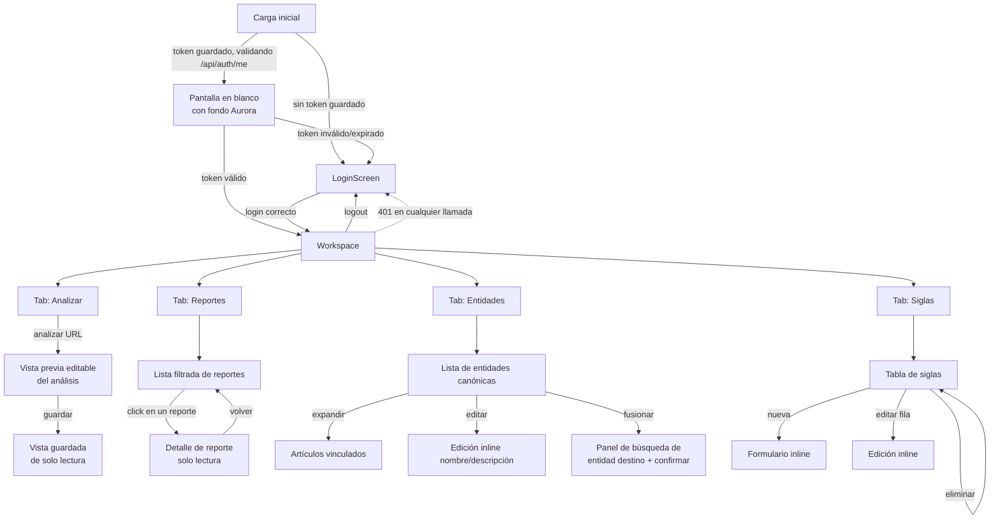

# Odin — Design Handoff

> Documento de traspaso para rediseño de UI. Describe la interfaz **tal como
> existe hoy** (código en `frontend/src/`), no cómo debería quedar. El
> objetivo es darle a quien va a rediseñar todo el contexto de producto,
> flujo, datos y restricciones técnicas sin que tenga que leer el código.

## 1. Qué es Odin

Odin es una herramienta interna de monitoreo de medios para República
Dominicana. Un operador (rol único, sin registro de usuarios) pega la URL de
una noticia; el backend la scrapea, la analiza con un LLM (sentimiento,
encuadre narrativo, actores mencionados) y devuelve un análisis estructurado.
El operador lo revisa, corrige lo que haga falta y lo guarda. Con el tiempo
se acumula un archivo de reportes consultable con filtros, más un catálogo
de "entidades canónicas" (figuras públicas / empresas, deduplicadas) y un
catálogo de siglas (para que "MINERD" se resuelva a "Ministerio de
Educación...", etc.).

Es una herramienta de trabajo, de uso repetido y prolongado por la misma
persona (probablemente un analista o periodista) — no un producto de
consumo masivo. Eso importa para el rediseño: densidad de información y
eficiencia de flujo de trabajo priman sobre "wow" visual, aunque el pedido
explícito es que se vea **seria/profesional**, no como un prototipo.

## 2. Usuarios

- Un solo rol: el operador que analiza y cura contenido.
- Login con usuario/contraseña fijos por variables de entorno — no hay
  registro, no hay recuperación de clave, no hay roles ni permisos
  diferenciados.
- Uso desde escritorio principalmente; hay algo de responsive (media
  queries en `PillNav.css` a 768px) pero no está pulido ni verificado a
  fondo en el código.

## 3. Stack técnico actual (contexto, no necesariamente a preservar)

- React 19 + Vite + TypeScript, sin router (navegación por estado local,
  `tab` en `useState`, no hay URLs por pantalla).
- Tailwind CSS v4 + [shadcn](https://ui.shadcn.com) (`components.json`:
  style `base-nova`, base color `neutral`, iconos `lucide`).
  `frontend/components.json` y `frontend/src/index.css` fijan los tokens.
- Primitivas de `@base-ui/react` (Button, Badge) en vez de Radix.
- Animaciones: GSAP para el nav (`PillNav`), `motion` (Framer Motion) para
  el texto shimmer del logo, `ogl` (WebGL) para el fondo "Aurora".
- Tipos del cliente API generados automáticamente desde el OpenAPI del
  backend (`frontend/src/lib/api-types.ts`, `frontend/openapi.json`) — ver
  §7.

## 4. Mapa de pantallas y flujo de navegación

Puntos clave del flujo:

- **No hay rutas / URLs por pantalla.** Todo vive en `useState` dentro de
  `App.tsx`. Recargar la página siempre vuelve al tab "Analizar". Esto es
  algo que el rediseño podría querer resolver (deep-linking a un reporte,
  a un tab, etc.) — no es un requisito del backend, es una limitación de
  cómo está armado el front hoy.
- **Cualquier 401 de la API devuelve al login** globalmente (evento
  `odin:auth-expired`), sin importar en qué pantalla esté el operador.
- El nav (`PillNav`) es una barra flotante centrada arriba, tipo pill, fija
  en todo momento dentro del workspace, con 4 tabs. El botón de logout es
  un ícono aparte, flotante arriba a la derecha.

## 5. Inventario de pantallas

### 5.1 Login (`LoginScreen.tsx`)

- Fondo Aurora a pantalla completa.
- Logo "ODIN" grande con efecto shimmer, centrado.
- Card con formulario: usuario, contraseña (ambos campos simples, sin
  validación más allá de "requerido").
- Botón de submit "hover interactivo" (icono de flecha que aparece al
  pasar el mouse).
- Alerta de error inline si falla el login (credenciales inválidas o no
  hay conexión con la API).
- Texto de ayuda: "Acceso restringido. El sistema no permite crear
  cuentas."
- Sin "recordarme", sin "olvidé mi contraseña", sin registro.

### 5.2 Analizar (tab por defecto del workspace)

Flujo de una sola pantalla, tres estados:

1. **Estado inicial**: logo ODIN + input de URL + botón "Analizar".
2. **Estado cargando**: skeleton de card (título + 3 líneas) mientras el
   backend analiza. Puede tardar (llamada a LLM), no hay indicador de
   progreso más que el skeleton y el botón en estado "Analizando…".
3. **Estado resultado**, que a su vez tiene dos variantes:
   - **Borrador (no guardado)**: todos los campos son editables — badge de
     sentimiento con selector, tema principal, palabras clave, encuadre
     (marco/titular/lead/fuentes como selects), actores (dominante,
     señalado, acreditado como inputs de texto), datos duros (badge fijo,
     no editable), y cada entidad mencionada en una card editable (nombre,
     tipo persona/organización, sentimiento hacia esa entidad, botón
     eliminar). Termina en un botón grande "Guardar cambios".
   - **Ya guardado (`already_saved`)**: la misma estructura pero de solo
     lectura — sin inputs, solo texto y badges. Aparece cuando el
     operador vuelve a analizar una URL que ya existía en la base.

Estructura de la card de resultado (de arriba a abajo):

- Badge de sentimiento global + indicador de si es vista previa o ya
  guardada.
- Título del artículo (link a la fuente original).
- Metadatos: fuente, autor, sección, fecha.
- Tema principal.
- Palabras clave (chips).
- Separador.
- "Análisis de encuadre": 4 categorías en grid (Marco, Titular, Lead,
  Fuentes — cada una es un enum con etiqueta legible) + 3 campos de actor
  + un badge de "Datos duros" sí/no.
- Separador.
- Cuerpo del artículo completo, en un contenedor con scroll interno
  (max-height, no ocupa toda la pantalla).
- Sección aparte: "Figuras y empresas mencionadas" — grid de 2 columnas de
  cards, una por entidad. Cada card: nombre, tipo, conteo de menciones,
  badge de sentimiento hacia esa entidad, cita de contexto en cursiva si
  existe. Si la confianza de extracción es baja (`< 0.9`), se muestra un
  ícono de advertencia con tooltip "revisar".

### 5.3 Reportes (`ReportsList.tsx`)

Lista + detalle, sin URL propia (estado local `selectedId`).

**Barra de filtros** (card fija arriba de la lista):

- Búsqueda por texto (título/tema).
- Búsqueda por entidad mencionada.
- Select de fuente (poblado dinámicamente desde `/api/articles/filters`).
- Selects de sentimiento, encuadre, intención del titular, orientación del
  lead, calidad de fuente.
- Select de "datos duros" (todos / con / sin).
- Rango de fechas (dos inputs `type=date`).
- Orden (más recientes / más antiguos).
- Botón "Limpiar filtros" que solo aparece si hay algún filtro activo.
- Los filtros de texto tienen debounce de 300ms antes de disparar la
  búsqueda.

**Lista de resultados:**

- Contador "X–Y de Z reportes" + botón "Quitar filtros".
- Skeletons (4 cards) mientras carga.
- Estado vacío: card centrada con mensaje.
- Cada fila (`ReportRow`): card clickeable completa (no un link
  discreto), con badge de sentimiento, badge de encuadre, badge "Datos
  duros" si aplica, título, fuente/sección/fecha/nº de entidades, tema
  principal.
- Paginación simple (anterior/siguiente + "Página X de Y"), 12 por
  página, solo visible si hay más de una página.

**Detalle de reporte** (`ReportDetail`): mismo layout que el resultado de
"Analizar" en su variante de solo lectura, con un botón "Volver a la
lista" arriba.

### 5.4 Entidades canónicas (`CanonicalEntityManager.tsx`)

Gestión de la lista maestra de figuras/organizaciones detectadas a través
de todos los artículos (deduplicación).

- Header: buscador + select de tipo (Persona/Organización).
- Lista densa de filas (no cards, filas de tabla informal con borde
  inferior), cada una:
  - Botón expandir/contraer (chevron).
  - Nombre + badge de tipo + descripción opcional truncada.
  - Conteo de artículos y menciones (oculto en mobile, `hidden sm:block`).
  - Acciones: fusionar (ícono `GitMerge`), editar (ícono lápiz).
  - **Edición inline**: al hacer click en editar, la fila se convierte en
    dos inputs (nombre, descripción) + check/cancelar.
  - **Expandir**: carga (lazy, on-demand) y muestra la lista de artículos
    vinculados a esa entidad (título con link, fecha, nº de menciones).
  - **Fusionar**: abre un panel inline debajo de la fila con buscador de
    "entidad destino" entre las ya cargadas en pantalla (mismo tipo,
    excluyendo la actual), lista de hasta 8 coincidencias con su conteo de
    artículos, y confirmación nativa del navegador (`window.confirm`)
    antes de ejecutar. Al fusionar, la entidad origen desaparece y sus
    menciones se suman a la destino (recarga completa de la lista tras la
    fusión, no hay actualización optimista de conteos).

### 5.5 Siglas (`AliasManager.tsx`)

CRUD de siglas → nombre canónico (p. ej. "MINERD" → "Ministerio de
Educación de la República Dominicana"), usado por el backend para resolver
menciones.

- Header: título + conteo ("N siglas · M activas") + botón "Nueva sigla" +
  buscador (debounce 300ms).
- Tabla real (`<table>`) con columnas: Sigla (fuente monoespaciada),
  Nombre canónico, Tipo (badge), Acciones.
- Filas inactivas con opacidad reducida (`opacity-45`).
- **Nueva sigla**: el botón se convierte en un formulario inline
  (sigla, nombre canónico, tipo) dentro de un recuadro con fondo distinto.
  El campo "sigla" se fuerza a mayúsculas al tipear.
- **Por fila**: activar/desactivar (ícono toggle, verde si activa),
  editar inline (mismo patrón que entidades canónicas), eliminar (con
  `window.confirm` nativo).

## 6. Componentes e inventario visual

| Componente | Archivo | Rol |
|---|---|---|
| `Aurora` / `SoftAurora` | `components/Aurora.tsx`, `SoftAurora.tsx` | Fondo animado WebGL (degradado violeta/rosa en movimiento), presente en *todas* las pantallas, con viñeta hacia el color de fondo del tema. Es el elemento de identidad visual más fuerte que existe hoy. |
| `PillNav` | `components/PillNav.tsx` + `.css` | Nav flotante centrado, forma de píldora, con animación de "burbuja" al hacer hover (GSAP) y colapso a menú hamburguesa en mobile (<768px). Colores hardcodeados en el propio componente vía props (`oklch(...)`), no 100% ligados a los tokens del tema. |
| `ShimmerText` | `components/ui/shimmer-text.tsx` | Texto con brillo animado en loop, usado solo para el wordmark "ODIN". |
| `InteractiveHoverButton` | `components/ui/interactive-hover-button.tsx` | Botón primario "de marca": el texto se desliza y aparece una flecha al hover. Usado en login y en "Analizar". Tiene ancho fijo (`w-32`) que puede quedar corto con textos largos ("Analizando…"). |
| `SentimentBadge` | `components/SentimentBadge.tsx` | Badge de color según sentimiento (verde=POS, rojo=NEG, gris=NEU) + score opcional en %. Reutilizado en Analizar, Reportes y entidades mencionadas. |
| Primitivas shadcn (`ui/`) | `button`, `input`, `card`, `badge`, `alert`, `separator`, `skeleton` | Base visual estándar de shadcn (estilo `base-nova`), sin personalización fuerte más allá de los tokens de color. |
| Selects nativos | inline en varios componentes | **No son un componente de shadcn** — son `<select>` HTML nativos con una clase Tailwind compartida (`selectClass`). Visualmente son el elemento menos cuidado de la interfaz hoy (aspecto de navegador, sin flecha custom, sin popover consistente). |

Nada de esto es una librería de diseño propia — es una combinación de
shadcn "de fábrica" más un par de componentes sueltos tipo
"React Bits"/"Magic UI" (Aurora, ShimmerText, InteractiveHoverButton)
pegados encima. No hay un sistema de diseño intencional detrás; es el
punto de partida más honesto para justificar por qué se pide un rediseño
serio.

## 7. Modelo de datos (contrato con el backend — no inventar campos)

El cliente API (`frontend/src/lib/odin-api.ts`) y sus tipos
(`frontend/src/lib/api-types.ts`) se generan automáticamente desde el
OpenAPI real del backend (`npm run generate:types`, ver
`frontend/openapi.json`). **Cualquier rediseño debe trabajar con esta
forma de datos, no inventar campos nuevos** — si hace falta un campo que
no existe, es un cambio de backend, no solo de UI.

Enumeraciones fijas que la UI traduce a español para mostrar (ver mapas
`FRAMING_LABELS`, `HEADLINE_LABELS`, `LEAD_LABELS`, `SOURCE_LABELS` en
`App.tsx` y `ReportsList.tsx` — están **duplicados** entre ambos archivos
hoy, candidato claro a unificar):

- **Sentimiento** (`POS` / `NEG` / `NEU`) → Positivo / Negativo / Neutro.
- **Encuadre (`framing`)**: `crisis_conflicto`, `logro_institucional`,
  `negligencia`, `crecimiento`, `denuncia`, `neutro_informativo`.
- **Intención del titular (`headline_intent`)**: `informativo`,
  `alarmista`, `sensacionalista`.
- **Orientación del lead (`lead_orientation`)**: `social`, `oficialista`,
  `tecnico`.
- **Calidad de fuente (`source_quality`)**: `citas_directas`,
  `testimonios_anonimos`, `datos_duros`, `mixtas`, `sin_fuentes`.
- **Tipo de entidad**: `PERSON` / `ORG`.

Un artículo analizado (`ArticleAnalysis`/`ArticleDetail`) trae, entre
otros: `title`, `url`, `source`, `authors`, `section`, `published_at`,
`body`, `main_topic`, `topic_keywords` (string separado por comas),
`overall_sentiment`, `sentiment_score`, los 4 campos de encuadre, los 3
campos de actor, `has_hard_data`, `already_saved`, y una lista de
`entities` (cada una con `name`, `type`, `mentions_count`,
`sentiment_toward`, `sentiment_score`, `context`, `extraction_confidence`
opcional).

## 8. Estados a diseñar (por cada vista que hace fetch)

Cada pantalla que llama a la API maneja, como mínimo, estos cuatro
estados — el rediseño debe tener un tratamiento consistente para los
cuatro en vez del actual (que varía ligeramente pantalla a pantalla):

1. **Cargando** — hoy: `Skeleton` genérico (barras grises pulsantes).
2. **Error** — hoy: `Alert` rojo inline, con mensaje del backend o uno
   genérico de "no se pudo conectar".
3. **Vacío** — hoy: texto centrado simple, mensaje distinto si hay un
   filtro activo o no.
4. **Con datos** — la vista normal.

Además, patrones transversales a tener en cuenta:

- **Confirmaciones destructivas usan `window.confirm()` nativo**
  (eliminar sigla, fusionar entidad). Es el punto más flojo de la UX
  actual — no hay componente de diálogo/modal propio en todo el proyecto.
  Fuerte candidato a resolver en el rediseño.
- **No hay sistema de notificaciones/toasts.** Los errores de acciones
  puntuales (guardar, eliminar) se muestran como texto rojo pegado al
  botón que falló, no como notificación global.
- **Edición inline generalizada**: tanto en Entidades como en Siglas, "editar" no
  abre un modal — transforma la fila/card en su versión editable in situ.
  Es un patrón consistente que vale la pena conservar o mejorar
  deliberadamente (no reemplazar por modales sin razón).
- **Debounce de 300ms** en todos los buscadores de texto.
- **Botones con solo ícono siempre llevan `aria-label`** — ya hay una
  base de accesibilidad razonable que no debería perderse.

## 9. Identidad visual actual (tokens en `frontend/src/index.css`)

- Tipografía: Geist Variable (única fuente, sans).
- Tema dominante: **oscuro** — `--background: oklch(0.15 0.014 285)`
  (casi negro con tinte violeta), `--primary: #7c6cff` (violeta), acento
  `oklch(0.28 0.05 320)` (magenta/rosa). El fondo Aurora refuerza esta
  paleta violeta→rosa en movimiento.
- Existen tokens para modo claro (`:root`, neutros grises estándar de
  shadcn) pero no hay ningún control en la UI para cambiar de tema — en la
  práctica la app se percibe/usa siempre en oscuro.
- Radios generosos (`--radius: 0.625rem` base, con escala hasta `4xl`),
  todo con esquinas redondeadas — cards, botones, badges, el propio nav en
  forma de píldora.
- Colores semánticos ya definidos: `--success` (verde) y `--warning`
  (ámbar) además de los estándar de shadcn (`--destructive`, etc.) — se
  usan en `SentimentBadge` y en el aviso de "revisar" por baja confianza.

## 10. Qué está fijo vs. qué es libre para el rediseño

**Fijo (contrato técnico, no se puede reinventar libremente):**

- Los endpoints y la forma de los datos (`odin-api.ts` / `api-types.ts`),
  generados desde el backend.
- Los valores de los enums (`framing`, `headline_intent`,
  `lead_orientation`, `source_quality`, `PERSON`/`ORG`, `POS`/`NEG`/`NEU`)
  — se puede reetiquetar/rediseñar cómo se muestran, no inventar valores
  nuevos.
- El flujo de autenticación: JWT en `localStorage`, sin registro, 401 →
  vuelta forzada al login.
- Las 4 áreas funcionales (Analizar, Reportes, Entidades, Siglas) y sus
  operaciones — el rediseño puede reorganizar cómo se presentan/navegan,
  pero no puede asumir que sobra o falta una entidad/verbo de negocio sin
  validarlo primero.

**Libre (todo esto es candidato explícito a rediseñar):**

- Paleta de color, tipografía, densidad, radios, todo el lenguaje visual.
- Si el fondo animado Aurora se mantiene, se atenúa o se elimina.
- Estructura de navegación (podría dejar de ser tabs planos si se
  justifica; hoy no hay router, así que introducir uno es una opción
  válida, no una migración forzada).
- Reemplazar `window.confirm()` por diálogos propios, agregar sistema de
  toasts, rediseñar los `<select>` nativos como componentes propios.
- Cómo se presenta el análisis de encuadre (hoy es una grilla densa de 4+3
  campos) — es información central del producto pero su jerarquía visual
  actual es plana, todo con el mismo peso.
- Layout de la lista de reportes (hoy es una lista vertical simple; podría
  ser tabla, grid con más contexto visual, etc.).
