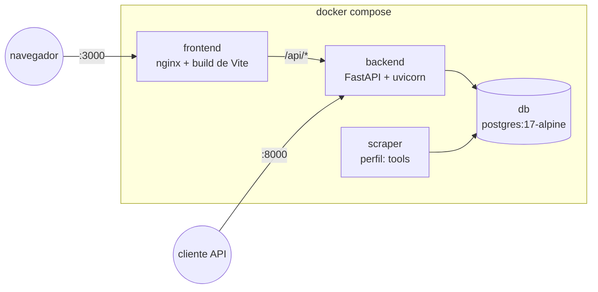

# Dockerización de Odin

Guía técnica de cómo está armado el stack Docker de Odin: qué servicios hay,
cómo están construidas las imágenes, cómo funciona el cacheo de dependencias
y cómo operarlo día a día. Para instalación sin Docker, ver
[GUIA_DE_USO.md](GUIA_DE_USO.md); para el stack tecnológico completo, ver el
[README](../README.md#stack-tecnológico).

---

## 1. Panorama general

`docker-compose.yml` define cuatro servicios:



| Servicio   | Imagen base         | Rol                                                             | Puerto host |
|------------|----------------------|------------------------------------------------------------------|-------------|
| `db`       | `postgres:17-alpine`| Base de datos                                                    | `5432`      |
| `backend`  | `python:3.12-slim`  | API FastAPI (`api.py`), sirve `/api/*`                           | `8000`      |
| `frontend` | `node:20-alpine` → `nginx:alpine` | SPA de React compilada, servida por nginx, con proxy a `backend` | `3000` → `80` |
| `scraper`  | `python:3.12-slim` (misma imagen que `backend`) | Corre `main.py` (el pipeline de scraping) bajo demanda | — |

`scraper` usa el **perfil** `tools` (`profiles: ["tools"]`), así que **no se
levanta** con un `docker compose up` normal — solo cuando se lo pide
explícitamente (ver [§4](#4-comandos-de-uso-diario)).

---

## 2. Cómo están armadas las imágenes

### 2.1 `backend` / `scraper` — `Dockerfile.backend`

Ambos servicios comparten la misma imagen (`build: { context: ., dockerfile:
Dockerfile.backend }`); lo único que cambia es el `command` (`scraper`
sobreescribe el `CMD` con `python main.py`).

```dockerfile
# syntax=docker/dockerfile:1
FROM python:3.13-slim
WORKDIR /app

COPY requirements.lock .
RUN --mount=type=cache,target=/root/.cache/pip \
    pip install --require-hashes -r requirements.lock

RUN --mount=type=cache,target=/root/.cache/pip \
    pip install https://.../es_core_news_lg-3.8.0-py3-none-any.whl

COPY . .
EXPOSE 8000
CMD ["uvicorn", "api:app", "--host", "0.0.0.0", "--port", "8000"]
```

Puntos clave:

1. **Se instala desde `requirements.lock`, no `requirements.txt`** — el lock
   fija con hash las 113 dependencias transitivas (ver
   [README.md#requirementslock](../README.md#requirementslock)), así que dos
   builds en fechas distintas instalan exactamente lo mismo.
   `--require-hashes` hace que el build falle si algo a instalar no trae hash
   en el lock, en vez de resolver silenciosamente una versión distinta.
   `requirements.txt` sigue siendo la fuente que declara las dependencias
   directas y de la que se regenera el lock — pero ya no es lo que entra a la
   imagen.
2. **`COPY requirements.lock .` antes que `COPY . .`** — el resto del código
   fuente (que cambia mucho más seguido que las dependencias) se copia
   *después* de instalar. Así, si el código cambia pero `requirements.lock`
   no, Docker reutiliza la capa de `pip install` completa, sin tocar la red.
3. **`FROM python:3.13-slim`** — `requirements.lock` se genera con `uv pip
   compile --python-version 3.13` (ver
   [README.md#requirementslock](../README.md#requirementslock)), así que sus
   hashes solo cubren ruedas para esa versión. Instalar con
   `--require-hashes` sobre un intérprete distinto no encuentra candidato
   válido y el build falla.
4. **Modelo de spaCy en su propio `RUN`** — `es_core_news_lg` no depende de
   `requirements.lock`, así que vive en una capa separada. Cambiar una
   dependencia de Python no obliga a re-descargar el modelo (~500 MB), y
   viceversa.
5. **`--mount=type=cache,target=/root/.cache/pip`** — cache de BuildKit,
   independiente del cacheo de capas de Docker. Persiste entre builds aunque
   la capa se invalide (por ejemplo, al agregar una dependencia nueva a
   `requirements.lock`). Efecto práctico: si agregás **una** librería nueva,
   `pip` solo descarga esa librería — el resto sale del cache local, no de
   la red.
6. **`psycopg2-binary`** trae `libpq` embebido, por eso no hace falta
   instalar headers de compilación (`gcc`, `libpq-dev`, etc.) en la imagen.

### 2.2 `frontend` — `frontend/Dockerfile` (multi-stage)

```dockerfile
# syntax=docker/dockerfile:1
FROM node:20-alpine AS build
WORKDIR /app
COPY package.json package-lock.json ./
RUN --mount=type=cache,target=/root/.npm \
    npm ci
COPY . .
RUN npm run build

FROM nginx:alpine
COPY nginx.conf /etc/nginx/conf.d/default.conf
COPY --from=build /app/dist /usr/share/nginx/html
EXPOSE 80
```

Dos etapas (*multi-stage build*):

1. **`build`** (`node:20-alpine`) — instala dependencias y compila la SPA
   (`vite build` → `dist/`). Mismo patrón que el backend: `package.json` +
   `package-lock.json` se copian antes que el resto del código, y
   `--mount=type=cache,target=/root/.npm` conserva el cache de npm entre
   builds aunque cambie el lockfile.
2. **Imagen final** (`nginx:alpine`) — **no** contiene Node, ni
   `node_modules`, ni el código fuente de React. Solo copia el resultado
   compilado (`/app/dist`) y la config de nginx. Esto mantiene la imagen de
   producción liviana (~unos pocos MB además de nginx) y sin herramientas de
   build innecesarias.

`nginx.conf` sirve la SPA (`try_files $uri /index.html`, para el
client-side routing de React) y hace de **proxy reverso**: todo lo que
llega a `/api/*` se reenvía a `http://backend:8000/api/`. Por eso el
frontend, dentro de Docker, le pega a la API por rutas relativas — no
necesita saber el host/puerto del backend.

### 2.3 `.dockerignore`

Evita que archivos irrelevantes (o pesados) entren al *build context* y
rompan el cache:

- Raíz (`/.dockerignore`): `.venv`, `__pycache__`, `.git`, `.env`, `odin.db`,
  `frontend/node_modules`, `frontend/dist`, `docs`.
- `frontend/.dockerignore`: `node_modules`, `dist`.

Esto es importante para el cache: si `node_modules` o `.venv` locales
entraran al contexto, cualquier cambio ahí invalidaría capas sin necesidad.

---

## 3. Cacheo de dependencias — qué se descarga y cuándo

| Qué                                                  | Dónde vive                                                   | Se re-descarga cuando…                              |
|-------------------------------------------------------|----------------------------------------------------------------|--------------------------------------------------------|
| Paquetes de `pip` (`requirements.lock`)               | Capa de Docker + cache de BuildKit (`/root/.cache/pip`)         | Cambia `requirements.lock` (y solo lo que cambió, gracias al cache de BuildKit) |
| Modelo de spaCy (`es_core_news_lg`, ~500 MB)          | Capa de Docker propia + cache de BuildKit                       | Cambia esa línea del `Dockerfile.backend` (rara vez) |
| Paquetes de `npm` (`package-lock.json`)               | Capa de Docker + cache de BuildKit (`/root/.npm`)                | Cambia `package.json` / `package-lock.json`          |
| Pesos de `pysentimiento` (Hugging Face, ~500 MB)      | **Volumen nombrado** `hf_cache` (`/root/.cache/huggingface`)    | Nunca, salvo que se borre el volumen (`docker volume rm`) — se descargan en el primer *request*, no en el build |
| Datos de Postgres                                     | **Volumen nombrado** `pgdata`                                   | Nunca — persiste entre `docker compose down` / `up` |

Diferencia importante entre las dos formas de cache:

- **Cache de capas de Docker / BuildKit** (pip, npm, modelo de spaCy) actúa
  en **build time**: evita descargas al reconstruir la imagen.
- **Volúmenes nombrados** (`hf_cache`, `pgdata`) actúan en **runtime**: no
  son parte de la imagen, sino datos que el contenedor lee/escribe en cada
  arranque y que sobreviven a `docker compose down` (pero no a
  `docker compose down -v`).

Docker (≥ 23) y Docker Compose v2 usan **BuildKit** por defecto, así que
todo esto funciona sin flags extra con:

```bash
docker compose build
docker compose up --build
```

---

## 4. Comandos de uso diario

```bash
# Levantar db + backend + frontend
docker compose up -d

# Ver logs
docker compose logs -f backend

# Reconstruir solo lo que cambió (usa el cache descrito arriba)
docker compose build

# Reconstruir forzando descarga completa (ignora todo el cache)
docker compose build --no-cache

# Correr el scraper una vez (perfil "tools", no queda levantado)
docker compose --profile tools run --rm scraper

# Con opciones del CLI (ver main.py --help)
docker compose --profile tools run --rm scraper python main.py --source diario_libre --limit 10

# Crear las tablas (una vez, o tras cambiar el modelo de datos)
docker compose --profile tools run --rm scraper python main.py --init-db

# Bajar todo (conserva volúmenes: pgdata, hf_cache)
docker compose down

# Bajar todo y borrar volúmenes (pierde datos + fuerza re-descarga de pesos HF)
docker compose down -v
```

---

## 5. Variables de entorno

`backend` y `scraper` leen `env_file: .env` (ver `.env.example`). El
`DATABASE_URL` efectivo dentro de Docker **no** sale de `.env`: lo arma
`docker-compose.yml` apuntando al servicio `db` interno de la red de
Compose:

```yaml
DATABASE_URL: postgresql+psycopg2://${POSTGRES_USER:-odin}:${POSTGRES_PASSWORD:-odin}@db:5432/${POSTGRES_DB:-odin}
```

Esto sobreescribe cualquier `DATABASE_URL` que tengas en `.env` (esa
variable en `.env` es solo para correr Odin **fuera** de Docker, contra un
Postgres en `localhost`). Las credenciales (`POSTGRES_USER`,
`POSTGRES_PASSWORD`, `POSTGRES_DB`) sí se toman de `.env` / el entorno, y se
usan tanto para levantar el contenedor `db` como para construir esa URL.

`GEMINI_API_KEY` (si se usa `GeminiAnalyzer`) también se lee de `.env` vía
`env_file` — pero por costo, no se ejecutan pruebas automatizadas contra la
API real (ver [../CLAUDE.md](../CLAUDE.md)).

---

## 6. Notas y troubleshooting

- **Primera corrida del backend**: aunque el build de la imagen no tarda
  (todo bajó del cache), el **primer request** a la API sí puede tardar
  varios segundos/minutos, porque `pysentimiento` descarga los pesos del
  modelo (~500 MB) a `hf_cache` recién en ese momento. Corridas siguientes
  usan el volumen y arrancan rápido.
- **BuildKit deshabilitado**: si por algún motivo `DOCKER_BUILDKIT=0` está
  seteado, los `--mount=type=cache` se ignoran (no rompen el build, pero se
  pierde el cache extra de pip/npm — sigue funcionando el cache de capas
  normal).
- **Puerto 5432 ocupado**: si ya corre un Postgres local en `5432`, cambiá
  el mapeo de puertos de `db` en `docker-compose.yml` o parate el Postgres
  local antes de `docker compose up`.
- **Reconstruir solo un servicio**: `docker compose build backend` (o
  `frontend`) reconstruye solo esa imagen sin tocar las demás.
